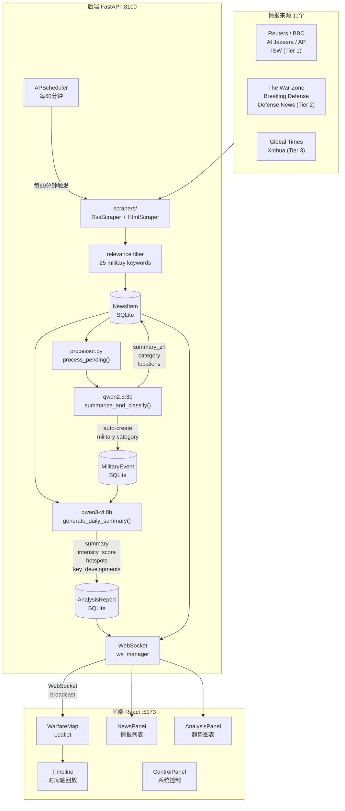
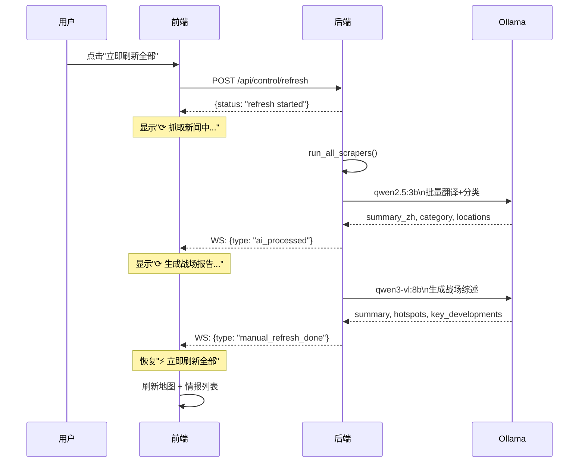

# BoShi 波斯 · 美伊战争态势实时展现系统

> 版本：v1.0 · 文档更新：2026-03-02

---

## 目录

1. [项目概述](#1-项目概述)
2. [系统架构](#2-系统架构)
3. [后端实现](#3-后端实现)
   - 3.1 [目录结构](#31-目录结构)
   - 3.2 [数据模型](#32-数据模型)
   - 3.3 [数据采集层](#33-数据采集层)
   - 3.4 [AI 处理管道](#34-ai-处理管道)
   - 3.5 [调度器与实时推送](#35-调度器与实时推送)
   - 3.6 [REST API 参考](#36-rest-api-参考)
4. [前端实现](#4-前端实现)
   - 4.1 [目录结构](#41-目录结构)
   - 4.2 [全局状态管理](#42-全局状态管理)
   - 4.3 [WebSocket 实时通信](#43-websocket-实时通信)
   - 4.4 [组件详解](#44-组件详解)
5. [部署与运行](#5-部署与运行)
6. [配置与扩展](#6-配置与扩展)

---

## 1. 项目概述

### 1.1 背景与定位

**BoShi 波斯**（英文代号 BOSHI）是一套面向军事爱好者的**美伊战争态势实时展现系统**。系统以中东 GIS 地图为主界面，通过自动爬取全球主流军事新闻媒体（以海外为主、国内为辅），结合本地部署的 Ollama 大语言模型，对原始情报进行翻译、分类、地理提取与战场综合分析，最终以可视化形式呈现：

- 陆、海、空军事力量部署与动向
- 各类军事事件（空袭、导弹、海战、地面冲突等）的实时标注
- AI 生成的中文战场态势综述与冲突烈度评估
- 支持时间轴回放的历史态势演变

### 1.2 技术栈

| 层次 | 技术 | 版本 | 用途 |
|------|------|------|------|
| 后端框架 | FastAPI | 0.115 | REST API + WebSocket |
| 异步运行时 | Uvicorn + asyncio | 0.32 | ASGI 服务器 |
| 数据库 | SQLite + aiosqlite | — | 本地轻量持久化 |
| ORM | SQLAlchemy | 2.0 | 异步数据访问层 |
| 任务调度 | APScheduler | 3.10 | 定时爬取与分析 |
| HTTP 客户端 | httpx + requests | — | 网页抓取 |
| HTML 解析 | BeautifulSoup4 + feedparser | — | RSS/HTML 内容提取 |
| AI 推理 | Ollama (本地) | — | 新闻摘要、战场报告 |
| 快速摘要模型 | qwen2.5:3b | — | 结构化 JSON 输出 |
| 战场分析模型 | qwen3-vl:8b | — | 长文本战略报告 |
| 前端框架 | React + TypeScript | 19 / 5.9 | UI 组件树 |
| 构建工具 | Vite | 7 | 热重载开发服务器 |
| GIS 地图 | Leaflet + react-leaflet | 1.9 / 5 | 交互式地图渲染 |
| 图表库 | Recharts | 3 | 烈度趋势/饼图 |
| 样式 | Tailwind CSS | 3 | 工具类样式 |
| 日期处理 | date-fns | 4 | 中文相对时间格式化 |

---

## 2. 系统架构

### 2.1 整体数据流



### 2.2 手动刷新流程

用户点击"立即刷新全部"按钮后，系统按以下阶段顺序执行完整管道，并通过 WebSocket 实时反馈进度：



---

## 3. 后端实现

### 3.1 目录结构

```
backend/
├── main.py               # FastAPI 应用入口，lifespan 管理，WebSocket 端点
├── scheduler.py          # APScheduler 定时任务 + ConnectionManager
├── seed_data.py          # 首次运行的演示数据填充脚本
├── requirements.txt      # Python 依赖
│
├── models/
│   ├── database.py       # SQLAlchemy 引擎、会话、init_db（含迁移）
│   └── schemas.py        # 6 个 ORM 模型定义
│
├── api/
│   ├── news.py           # /api/news — 新闻列表与详情
│   ├── events.py         # /api/events、/api/units、/api/zones
│   ├── analysis.py       # /api/analysis — 报告、趋势、生成触发
│   └── control.py        # /api/control — 源管理、刷新、重翻译
│
├── pipeline/
│   ├── ollama_client.py  # Ollama 封装：summarize、analyze_image、daily_summary
│   └── processor.py      # save_raw_articles、process_with_ai、process_pending
│
└── scrapers/
    ├── base.py           # RawArticle 数据类、BaseScraper 抽象、RssScraper
    └── sources.py        # 11 个具体爬虫 + SCRAPER_MAP
```

### 3.2 数据模型

系统使用 SQLite 数据库（`data/warfare.db`），共 6 张表：

#### NewsItem（`news`）

| 字段 | 类型 | 说明 |
|------|------|------|
| `id` | Integer PK | 自增主键 |
| `source` | String | 来源名称（Reuters、BBC 等）|
| `source_tier` | Integer | 来源等级：1=一级、2=二级、3=国内 |
| `title` | String | 原文标题（英文）|
| `url` | String UNIQUE | 文章 URL（去重依据）|
| `content` | Text | 正文内容（BeautifulSoup 提取）|
| `summary_zh` | Text | AI 生成的中文摘要（3-5 句）|
| `category` | String | 分类：airstrike/missile/naval/land/diplomacy/sanction/movement/other |
| `confidence` | Float | AI 置信度 0–1 |
| `locations` | JSON | 地理位置数组 `[{name, lat, lon}]`，仅保留中东范围 |
| `image_url` | String | 封面图 URL |
| `image_analysis` | Text | AI 图像军事分析（仅突发新闻）|
| `is_breaking` | Boolean | 是否突发（直接军事行动）|
| `published_at` | DateTime | 原文发布时间 |
| `fetched_at` | DateTime | 系统抓取时间 |
| `processed` | Boolean | 是否已经过 AI 处理 |

#### MilitaryEvent（`events`）

| 字段 | 类型 | 说明 |
|------|------|------|
| `id` | Integer PK | |
| `event_type` | String | airstrike/missile/naval/land/diplomacy/sanction/movement/other |
| `side` | String | us/iran/proxy/neutral |
| `title` | String | 事件标题 |
| `description` | Text | 详细描述（中文）|
| `lat` / `lon` | Float | 事件坐标 |
| `location_name` | String | 地名 |
| `occurred_at` | DateTime | 事件发生时间 |
| `source_news_id` | Integer FK | 关联新闻 ID |
| `confirmed` | Boolean | 是否已确认（confidence ≥ 0.7）|
| `severity` | Integer | 严重程度 1–5 |

#### MilitaryUnit（`units`）

| 字段 | 类型 | 说明 |
|------|------|------|
| `id` | Integer PK | |
| `name` | String | 部队/舰队名称 |
| `unit_type` | String | carrier/destroyer/airbase/army/missile/drone |
| `side` | String | us/iran/proxy |
| `lat` / `lon` | Float | 当前位置 |
| `location_name` | String | 驻扎地名 |
| `status` | String | deployed/moving/engaged/withdrawn |
| `description` | Text | 兵力描述 |
| `extra` | JSON | 附加属性（兵力数量等）|

#### ControlZone（`control_zones`）

| 字段 | 类型 | 说明 |
|------|------|------|
| `id` | Integer PK | |
| `name` | String | 区域名称 |
| `zone_type` | String | patrol/exclusion/blockade/control |
| `side` | String | us/iran/neutral |
| `geometry` | JSON | GeoJSON Polygon 坐标 |
| `description` | Text | 区域说明 |

#### AnalysisReport（`analysis`）

| 字段 | 类型 | 说明 |
|------|------|------|
| `id` | Integer PK | |
| `report_type` | String | daily_summary |
| `content` | Text | 300-400 字综合态势分析（中文）|
| `generated_at` | DateTime | 生成时间 |
| `period_start` / `period_end` | DateTime | 分析时间范围 |
| `intensity_score` | Float | 冲突烈度 0–10 |
| `hotspots` | JSON | 热点区域 `[{name, lat, lon, score, reason}]` |
| `key_developments` | JSON | 关键进展要点字符串数组 |
| `outlook` | Text | 50 字未来态势研判 |

#### ScraperStatus（`scraper_status`）

| 字段 | 类型 | 说明 |
|------|------|------|
| `id` | Integer PK | |
| `source_id` | String UNIQUE | 爬虫唯一标识 |
| `source_name` | String | 来源名称 |
| `enabled` | Boolean | 是否启用 |
| `last_run` | DateTime | 最近一次运行时间 |
| `last_success` | DateTime | 最近一次成功时间 |
| `last_count` | Integer | 最近一次保存文章数 |
| `error_msg` | Text | 最近一次错误信息 |
| `auto_interval_minutes` | Integer | 自动更新间隔（分钟，默认 60）|

### 3.3 数据采集层

#### 信息来源分级

| 等级 | 来源 | source_id | 类型 |
|------|------|-----------|------|
| Tier 1 | Reuters | `reuters_world` | RSS |
| Tier 1 | BBC World (Middle East) | `bbc_world` | RSS |
| Tier 1 | Al Jazeera | `aljazeera` | RSS |
| Tier 1 | AP News | `apnews` | RSS（via RSSHub）|
| Tier 1 | ISW Iran Update | `isw` | HTML 直接爬取 |
| Tier 2 | The War Zone | `warzone` | RSS |
| Tier 2 | Breaking Defense | `breaking_defense` | RSS |
| Tier 2 | Defense News | `defense_news` | RSS |
| Tier 2 | Politico Defense | `politico` | RSS |
| Tier 3 | Global Times | `globaltimes` | RSS |
| Tier 3 | Xinhua | `xinhua` | RSS |

#### RssScraper 异步抓取流程

```
1. httpx.AsyncClient.get(rss_url)          # 异步 HTTP 请求
2. asyncio.to_thread(feedparser.parse, text) # 同步 CPU 密集型解析在线程池执行
3. BeautifulSoup(entry.content).get_text()  # 提取正文纯文本
4. 提取图片 URL（media_content / enclosures）
5. 返回 RawArticle 列表
```

> `feedparser.parse` 是同步阻塞调用，必须通过 `asyncio.to_thread` 放入线程池，避免阻塞 asyncio 事件循环。

#### 相关性过滤

在保存任何文章前，`processor.is_relevant()` 会在标题+正文中匹配以下 25 个关键词（不区分大小写）：

```
iran, persian gulf, hormuz, tehran, oman sea, irgc,
revolutionary guard, centcom, us military, pentagon,
carrier, strike group, missile, drone, airstrike,
houthi, hezbollah, hamas, iraq militia, proxy,
sanction, nuclear, enrichment, warship, f-35, f-22,
b-52, patriot, iron dome, ballistic
```

不匹配的文章直接丢弃，不写入数据库。

### 3.4 AI 处理管道

#### 模型分工策略

| 模型 | 用途 | 特性 | token 预算 |
|------|------|------|-----------|
| `qwen2.5:3b` | 新闻摘要与分类 | 结构化 JSON 输出能力强，响应快 | 700 |
| `qwen3-vl:8b` | 战场综合报告、图像分析 | CoT 在 Ollama 的 `thinking` 字段，`content` 为空需要高 token 预算 | 8192 |

> **关键设计**：`qwen3-vl:8b` 会将所有 CoT 推理放入 `thinking` 字段，`content` 字段保持空白直到推理完成才输出。因此需要 8192 token 预算让其完成推理后再生成 JSON 输出；若 token 耗尽则 `content` 始终为空，需从 `thinking` 字段提取内容作为降级方案。

#### `summarize_and_classify(title, content)` — 新闻处理

使用 `qwen2.5:3b`。Prompt 包含一个 few-shot 示例，要求模型返回固定结构的 JSON：

```json
{
  "summary_zh": "3-5句中文摘要（必须是中文）",
  "category": "airstrike|naval|land|missile|diplomacy|sanction|movement|other",
  "confidence": 0.0,
  "locations": [{"name": "地名", "lat": 0.0, "lon": 0.0}],
  "is_breaking": false
}
```

置信度规则：`0.9` 用于 Reuters/AP/BBC/ISW，`0.7` 用于二级来源，`0.5` 用于其他。`locations` 仅保留中东坐标范围内（纬度 10–43°，经度 25–65°）的地点。

#### `generate_daily_summary(events_text, news_text)` — 战场报告

使用 `qwen3-vl:8b`，`num_predict=8192`，`timeout=480s`。输入为过去 24 小时的新闻摘要（最多 50 条）和事件列表（最多 30 条）。要求返回：

```json
{
  "summary": "300-400字综合态势分析",
  "intensity_score": 5.0,
  "key_developments": ["要点1", "要点2", "要点3"],
  "hotspots": [{"name": "地区", "lat": 0.0, "lon": 0.0, "score": 5.0, "reason": "原因"}],
  "outlook": "50字未来研判"
}
```

#### `analyze_image(image_url)` — 图像分析

仅对 `is_breaking=True` 且有图片的新闻触发。下载图片 → base64 编码 → 发送给 `qwen3-vl:8b` 视觉模型，返回 2-3 句中文军事描述（关注军事装备、位置线索、行动类型、军事意义）。

#### `process_with_ai()` — 单条新闻处理逻辑

```
1. summarize_and_classify(title, content)
2. 更新 NewsItem 字段（summary_zh, category, confidence, locations, processed=True）
3. 如果 category in (airstrike, missile, naval, land) AND 存在有效中东位置：
   → 自动创建 MilitaryEvent（severity=3 if is_breaking else 2，confirmed if confidence≥0.7）
4. 如果 is_breaking AND 有 image_url：
   → analyze_image() → 更新 image_analysis
5. db.commit()
```

#### Semaphore 串行化

```python
_semaphore = asyncio.Semaphore(1)  # 所有 Ollama 调用串行执行
```

防止在模型加载期间出现并发请求。每次 Ollama 调用（包括翻译和报告生成）都必须先获取信号量，确保同一时刻只有一个请求发送给 Ollama。

### 3.5 调度器与实时推送

#### 定时任务（60 分钟间隔）

```python
scheduler.add_job(run_all_scrapers,   IntervalTrigger(minutes=60))
scheduler.add_job(run_daily_analysis, IntervalTrigger(minutes=60))
```

`run_all_scrapers()` 执行顺序：

1. `asyncio.gather(*[run_scraper(sid) for sid in SCRAPER_MAP])` — 所有爬虫并行抓取
2. `process_pending(db, limit=30)` — AI 批量处理最多 30 条新文章
3. `unload_model()` — 发送 `keep_alive: 0` 将模型从 GPU VRAM 中驱逐，释放显存

#### WebSocket ConnectionManager

```python
class ConnectionManager:
    active: set[WebSocket]

    async def connect(ws)     # 接受连接，加入 active
    def disconnect(ws)        # 移出 active
    async def broadcast(msg)  # 向所有活跃连接广播 JSON，自动清理失效连接
```

广播消息类型：

| 消息类型 | 触发时机 | 携带数据 |
|---------|---------|---------|
| `new_articles` | 爬虫保存新文章后 | source, count |
| `ai_processed` | AI 批量处理完成后 | count |
| `analysis_updated` | 战场报告生成完成后 | report_type, intensity_score |
| `manual_refresh_done` | 手动刷新全流程完成后 | ai_processed, analysis_updated |

### 3.6 REST API 参考

#### 新闻 `/api/news`

| 方法 | 路径 | 说明 |
|------|------|------|
| GET | `/api/news` | 分页新闻列表。参数：`page`, `size`, `category`, `source_tier`, `breaking_only`, `since`, `until`, `q`（全文搜索）|
| GET | `/api/news/{news_id}` | 单条新闻详情 |

#### 事件 `/api/events`

| 方法 | 路径 | 说明 |
|------|------|------|
| GET | `/api/events` | 事件列表。参数：`event_type`, `side`, `since`, `until`, `confirmed_only`, `min_severity`，最多 500 条 |
| GET | `/api/events/geojson` | GeoJSON FeatureCollection 格式（供 Leaflet 使用）|

#### 军事单位 `/api/units`

| 方法 | 路径 | 说明 |
|------|------|------|
| GET | `/api/units` | 单位列表。参数：`side`, `unit_type` |
| GET | `/api/units/geojson` | GeoJSON 格式 |

#### 控制区域 `/api/zones`

| 方法 | 路径 | 说明 |
|------|------|------|
| GET | `/api/zones` | 区域列表。参数：`zone_type`, `side` |
| GET | `/api/zones/geojson` | GeoJSON 格式 |

#### 分析 `/api/analysis`

| 方法 | 路径 | 说明 |
|------|------|------|
| GET | `/api/analysis/latest` | 最新报告（默认 `daily_summary` 类型）|
| GET | `/api/analysis/history` | 历史报告列表（默认最近 10 条）|
| POST | `/api/analysis/generate` | 手动触发 AI 分析（后台任务）|
| GET | `/api/analysis/intensity` | 日均冲突烈度 + 事件类型分布。参数：`days`（1-30，默认 7）|
| GET | `/api/analysis/ollama/health` | Ollama 健康检查（确认 `qwen2.5:3b` 及 `qwen3` 可用）|

#### 系统控制 `/api/control`

| 方法 | 路径 | 说明 |
|------|------|------|
| GET | `/api/control/sources` | 所有爬虫来源状态 |
| PATCH | `/api/control/sources/{source_id}` | 更新来源（enabled、auto_interval_minutes）|
| POST | `/api/control/refresh` | 触发完整刷新管道（爬取→AI处理→报告生成）|
| POST | `/api/control/retranslate` | 将 `summary_zh` 无中文字符的条目标记为待处理，用于批量重翻译 |
| GET | `/api/control/status` | 系统统计（新闻总数、事件总数、未处理数）|

#### 其他

| 方法 | 路径 | 说明 |
|------|------|------|
| GET | `/api/health` | 系统健康检查 |
| WS | `/ws` | WebSocket 实时推送端点，支持 ping/pong 心跳 |

---

## 4. 前端实现

### 4.1 目录结构

```
frontend/
├── index.html                    # Google Fonts 引入，页面标题
├── vite.config.ts                # Vite 构建配置
├── tailwind.config.js            # Tailwind 配置
└── src/
    ├── main.tsx                  # React 根入口
    ├── App.tsx                   # 顶层组件，布局骨架，全局状态协调
    ├── index.css                 # 全局样式（CSS filter 深色地图主题）
    │
    ├── api/
    │   ├── client.ts             # Axios 实例 + 16 个 API 函数
    │   └── types.ts              # 8 个 TypeScript 接口 + WsMessage 联合类型
    │
    ├── store/
    │   └── useAppStore.ts        # 模块级全局状态（无 Redux/Zustand）
    │
    ├── hooks/
    │   └── useWebSocket.ts       # WebSocket hook，自动重连，30s 心跳
    │
    └── components/
        ├── Map/
        │   ├── WarfareMap.tsx    # 核心 Leaflet 地图，6 个图层组
        │   ├── IntensityOverlay.tsx  # 冲突烈度叠加层（左下角 sparkline）
        │   ├── LayerControl.tsx  # 图层开关面板（右上角）
        │   ├── mapIcons.ts       # 所有 Leaflet divIcon 图标工厂
        │   ├── EventPopup.tsx    # 事件弹窗（静态 HTML，供 Leaflet bindPopup）
        │   └── UnitPopup.tsx     # 军事单位弹窗
        │
        ├── News/
        │   └── NewsPanel.tsx     # 情报列表 + AI 战场综述（展开时占 70%）
        │
        ├── Analysis/
        │   └── AnalysisPanel.tsx # 历史趋势图（AreaChart + PieChart）
        │
        ├── Control/
        │   └── ControlPanel.tsx  # 系统控制（来源管理、刷新按钮、统计）
        │
        ├── Timeline/
        │   └── Timeline.tsx      # 时间轴回放条（绝对定位于地图底部）
        │
        └── UI/
            ├── Header.tsx        # 顶部导航栏（状态徽章、时钟、数据更新时间）
            └── SidePanel.tsx     # 右侧面板容器（标签切换：情报/分析/系统）
```

### 4.2 全局状态管理

`useAppStore.ts` 使用模块级变量 + React `useState` 实现轻量级全局状态，无需 Redux 或 Zustand：

| 状态字段 | 类型 | 默认值 | 说明 |
|---------|------|--------|------|
| `layers.us_units` | boolean | true | 显示美军单位图层 |
| `layers.iran_units` | boolean | true | 显示伊朗单位图层 |
| `layers.proxy_units` | boolean | true | 显示代理武装图层 |
| `layers.events` | boolean | true | 显示军事事件图层 |
| `layers.control_zones` | boolean | true | 显示控制区域图层 |
| `layers.heatmap` | boolean | false | 显示热力图图层 |
| `autoRefresh` | boolean | true | 是否自动刷新 |
| `refreshInterval` | number | 60 | 自动刷新间隔（分钟）|
| `selectedEvent` | MilitaryEvent \| null | null | 当前选中的事件 |
| `selectedNews` | NewsItem \| null | null | 当前选中的新闻 |
| `activePanel` | string | `'news'` | 右侧面板：news/analysis/control |
| `timeline.enabled` | boolean | false | 是否启用时间轴过滤 |
| `timeline.startDate` | Date | 45 天前 | 时间轴起始时间 |
| `timeline.endDate` | Date | 当前时间 | 时间轴结束时间 |
| `timeline.currentDate` | Date | 当前时间 | 时间轴当前游标位置 |
| `timeline.playing` | boolean | false | 是否正在播放 |
| `timeline.speedMultiplier` | number | 1 | 播放速度倍数（0.5/1/2/4）|

**通知系统**：模块级 `_globalNotifications: string[]`（最多 10 条）+ 监听器模式。任何组件调用 `pushNotification(msg)` 均可触发全局通知 ticker 更新。

### 4.3 WebSocket 实时通信

`useWebSocket.ts` 连接 `ws://localhost:8100/ws`，具备：

- **自动重连**：`onclose` 后 5 秒重连
- **心跳保活**：每 30 秒发送 `{type: "ping"}`，服务端回复 `{type: "pong"}`
- **稳定回调**：使用 `useRef` 保存处理函数，避免每次回调变化触发 WebSocket 重建

消息类型（TypeScript 联合类型 `WsMessage`）：

| `type` | 触发场景 | 前端响应 |
|--------|---------|---------|
| `new_articles` | 爬虫保存新文章 | 通知 ticker 显示"新增 N 条情报" |
| `ai_processed` | AI 批量翻译完成 | `refreshPhase` → `'reporting'`，通知 ticker |
| `analysis_updated` | 战场报告生成完成 | 重新拉取 `fetchLatestReport()`，更新地图热点和烈度评分 |
| `manual_refresh_done` | 手动刷新全流程结束 | `refreshPhase` → `'idle'`，触发地图数据刷新 |
| `pong` | 服务端心跳响应 | 无操作 |

### 4.4 组件详解

#### Header

顶部导航栏（高度 44px，`zIndex: 2000`）。

| 元素 | 说明 |
|------|------|
| BOSHI · 波斯 Logo | 红色⚔图标 + 系统名称 |
| LIVE 徽章 | 自动刷新开启时红色脉冲动画 |
| AI 徽章 | Ollama 可达时青色点亮，否则灰色 |
| 数据更新时间 | 取所有来源最新 `last_success`，显示为"xx小时xx分钟前"，每 2 分钟自动更新 |
| 通知 Ticker | 显示最新系统通知，`▶ SYS` 前缀，终端风格 |
| 时间轴按钮 | 展开/收起时间轴条，激活时青色高亮 |
| UTC 时钟 | 每秒刷新的 `HH:mm:ss` 时钟 |

---

#### WarfareMap

系统核心地图组件，基于 Leaflet 构建。

- **底图**：CartoDB Positron（`https://{s}.basemaps.cartocdn.com/light_all/{z}/{x}/{y}{r}.png`），应用 CSS filter `invert(1) brightness(0.85) hue-rotate(180deg) saturate(0.5)` 实现深色军事风格
- **初始视野**：中心 `[28, 52]`（波斯湾区域），zoom 5
- **6 个图层组**：`us_units`、`iran_units`、`proxy_units`、`events`、`control_zones`、`hotspots`

| 功能 | 实现 |
|------|------|
| 事件标记 | `L.marker` + `getEventIcon(type)`，突发事件图标带 CSS ping 动画 |
| 军事单位 | `L.marker` + `getUnitIcon(unit_type, side)` |
| 控制区域 | `L.polygon`，颜色按 `zone_type` 区分，exclusion 区使用虚线边框 |
| 热点圆圈 | `L.circle`，半径 = `score * 18000` 米，≥7分红色，其余橙色 |
| 时间轴过滤 | `timelineFrom`/`timelineTo` prop 传入，过滤 events 查询的时间范围 |
| 防抖刷新 | `loadData` 调用防抖 800ms，避免时间轴快速拖拽时 API 洪泛 |
| 弹窗渲染 | `renderToStaticMarkup(<EventPopup />)` 将 React 组件渲染为 Leaflet bindPopup 的静态 HTML |
| 外部刷新 | 挂载 `window.__warfareMapRefresh()`，供 App.tsx 在 WebSocket 事件后调用 |

---

#### IntensityOverlay

绝对定位于地图左下角的**冲突烈度叠加层**。

- 展示数字：AI 报告的 `intensity_score`（0-10 归一化），格式 `5.0 /10`
- 颜色阈值：≥8 红色 · ≥6 橙色 · ≥4 黄色 · <4 绿色
- Sparkline 图表：Recharts `AreaChart`（210×60px），显示近 7 天日活跃指数趋势（每 10 分钟自动刷新）
- 时间轴适配：当时间轴打开时（`timelineActive=true`），`bottom` 从 10px 自动上移至 114px，CSS transition 平滑过渡，避免遮挡
- 可折叠：点击标题栏切换展开/收起状态

---

#### LayerControl

右上角图层开关面板（`zIndex: 1000`）。提供 6 个图层的 pill 式切换按钮，每个图层有独立颜色：

| 图层 | 图标 | 颜色 |
|------|------|------|
| 美军单位 | ✈ | 蓝色 `#1a6fb5` |
| 伊朗单位 | ⚔ | 红色 `#cc2222` |
| 代理武装 | ★ | 橙色 `#cc8800` |
| 军事事件 | ⚡ | 青色 `#00d4ff` |
| 控制区域 | ▣ | 紫色 `#9c66ff` |
| 热力图 | 🌡 | 黄色 `#ffdd00` |

---

#### NewsPanel

情报面板，由新闻列表区和 AI 战场综述区两部分组成，采用弹性布局：

**新闻列表区**：

- 7 个分类过滤器（全部、空袭、导弹、海战、地面、外交、制裁）+ 突发新闻切换
- 每页 20 条，支持翻页
- `NewsCard` 展示：`summary_zh`（AI 中文摘要）优先，无摘要时降级为英文 title
- 突发新闻：`● 突发` 红色徽章 + 淡红背景
- 来源颜色：Tier 1 青色 · Tier 2 紫色 · Tier 3 琥珀色

**AI 战场综述区（展开/收起）**：

| 状态 | 新闻列表 | AI 综述区 |
|------|---------|---------|
| 收起 | `flex: 1`（占满）| 仅标题栏（约 34px）|
| 展开 | `flex: 0 0 30%` | `flex: 1`（约 70%，可滚动）|

展开后依次显示：

1. **烈度仪表**：渐变进度条 + 数值
2. **综合态势**：完整 AI 摘要全文
3. **关键进展**：带编号的要点列表（`key_developments[]`）
4. **热点区域**：最多 4 个区域，含名称、原因、评分
5. **态势研判**：`outlook` 字段，紫色斜体样式
6. **生成时间** + **立即生成分析**按钮

---

#### AnalysisPanel

历史数据分析面板（7/14/30 天切换）：

- **烈度趋势图**（`AreaChart`，高 130px）：日均事件烈度时序，橙色渐变填充
- **事件类型分布饼图**（`PieChart`，高 160px，圆环样式）：各类事件占比，颜色按类型区分
- **统计卡片**：平均烈度（客户端计算）、事件总数

---

#### ControlPanel

系统管理面板，3 个功能区：

1. **系统状态**：新闻总数、事件总数、未处理数、Ollama 状态（4 个 StatCard）
2. **自动刷新控制**：pill 切换 + 间隔选择（5/15/30/60 分钟）
3. **手动刷新按钮**：根据当前 `refreshPhase` 动态显示文本和提示：

| Phase | 按钮文本 | 提示 |
|-------|---------|------|
| idle | ⚡ 立即刷新全部 | — |
| scraping | ⟳ 抓取新闻中... | 正在从 11 个来源抓取最新情报... |
| analyzing | ⟳ AI 分析新闻... | 正在翻译并分类新闻条目... |
| reporting | ⟳ 生成战场报告... | AI 正在生成综合态势报告... |

**来源列表**：11 个来源按 Tier 分组显示，每个来源行显示最后成功时间（中文相对时间）、最近获取数量、启用/禁用开关、错误状态。

---

#### Timeline

绝对定位于地图底部的时间轴回放条。

| 功能 | 说明 |
|------|------|
| 显示条件 | 仅当 `timeline.enabled=true` 时渲染 |
| 事件点 | 从 API 获取时间范围内所有事件，按 `severity * 2`（最小 4px）绘制彩色圆点 |
| 游标进度 | `currentDate` 在 `startDate`~`endDate` 内的比例映射到轨道宽度 |
| 拖拽跳转 | mousedown/mousemove/mouseup 全局监听实现拖拽定位 |
| 播放逻辑 | 每 500ms 推进 `6 * speedMultiplier` 小时；`currentDateRef` 避免 stale closure |
| 自动回绕 | 点击播放时，若游标已到达终点则自动回绕至起点 |
| 速度控制 | 0.5× / 1× / 2× / 4× |
| 时间标签 | 轨道下方 0%/25%/50%/75%/100% 五个时间标签 |
| 历史可见性 | 已过游标的事件点全不透明；未来事件点 33% 透明度 |

---

## 5. 部署与运行

### 5.1 前置条件

| 依赖 | 版本要求 | 说明 |
|------|---------|------|
| [Ollama](https://ollama.ai) | 最新版 | 本地 AI 推理服务，端口 11434 |
| `qwen3-vl:8b` 模型 | 6.1 GB | 战场报告生成 |
| `qwen2.5:3b` 模型 | 1.9 GB | 新闻摘要翻译 |

```bash
# 安装 Ollama 模型
ollama pull qwen3-vl:8b
ollama pull qwen2.5:3b
```

### 5.2 一键启动

```bash
cd BoShi2025
chmod +x start.sh
./start.sh
```

`start.sh` 执行步骤：

1. 检查 Ollama 是否运行（端口 11434），不可用时警告但继续
2. 检查 `qwen3-vl:8b` 是否已下载，未下载时警告
3. 创建 Python venv（若不存在），安装 `requirements.txt`
4. 终止占用 8100 端口的进程
5. 在后台启动 `uvicorn main:app --host 0.0.0.0 --port 8100 --reload`
6. 等待 3 秒后健康检查 `http://localhost:8100/api/health`
7. 安装 npm 依赖（若 `node_modules` 不存在）
8. 终止占用 5173 端口的进程
9. 在后台启动 `npm run dev -- --port 5173`
10. 注册 `CTRL+C` 信号，退出时清理两个后台进程

### 5.3 访问地址

| 服务 | 地址 (本地) | 说明 |
| :--- | :--- | :--- |
| **前端界面** | `http://localhost:5173` | 系统主入口 (远程访问请使用局域网 IP) |
| **API 文档** | `http://localhost:8100/docs` | Swagger UI 交互文档 |
| **数据监控** | `http://localhost:8100/api/health` | 检查后端运行状态 |

### 5.4 首次运行说明

数据库首次创建时系统会自动调用 `seed_data.py` 填充演示数据：

- **19 个军事单位**（美军航母、驱逐舰、空军基地；伊朗革命卫队海军、导弹阵地、防空系统；代理武装）
- **4 个控制区域**（霍尔木兹海峡美军巡逻区、伊朗禁区、红海胡塞威胁区、波斯湾商船航道）
- **12 个历史军事事件**（跨越 45 天，覆盖各类事件类型）
- **6 条预处理新闻**（含中文摘要）

### 5.5 手动运维操作

```bash
# 重新翻译所有英文摘要（首次部署后修复历史数据）
curl -X POST http://localhost:8100/api/control/retranslate

# 触发完整数据刷新（爬取+AI处理+报告生成）
curl -X POST http://localhost:8100/api/control/refresh

# 检查系统状态
curl http://localhost:8100/api/control/status

# 检查 Ollama 连接状态
curl http://localhost:8100/api/analysis/ollama/health
```

---

## 6. 配置与扩展

### 6.1 新增爬虫来源

在 `backend/scrapers/sources.py` 中添加新类：

```python
class MyNewSource(RssScraper):
    source_id = "my_source"
    source_name = "My Source Name"
    source_tier = 2
    rss_url = "https://example.com/rss"
    max_items = 15
```

然后在 `SCRAPER_MAP` 中注册，并在 `seed_data.py` 的 `ScraperStatus` 列表中添加对应记录。

### 6.2 更换或新增 AI 模型

在 `backend/pipeline/ollama_client.py` 中修改：

```python
FAST_MODEL = "deepseek-r1:1.5b"    # 用于新闻摘要分类（替换为更快或更准的模型）
ANALYSIS_MODEL = "qwen3-vl:8b"     # 用于战场报告生成（需支持长上下文）
```

注意：

- `FAST_MODEL` 需要能够输出结构化 JSON，支持中文生成，响应时间建议 < 10s/条
- `ANALYSIS_MODEL` 需要支持 8192+ token 输出，建议为视觉语言模型（用于图像分析）
- 使用 deepseek-r1 系列模型时，其 `<think>` 标签会被 `_parse_json_from_response` 自动过滤
- 使用 qwen3 系列模型时，`thinking` 字段由 `_chat_sync` 自动作为 `content` 的降级来源

### 6.3 调整更新间隔

在 `backend/scheduler.py` 的 `setup_scheduler()` 中修改触发器：

```python
# 将更新间隔从 60 分钟改为 30 分钟
scheduler.add_job(run_all_scrapers, IntervalTrigger(minutes=30), ...)
scheduler.add_job(run_daily_analysis, IntervalTrigger(minutes=30), ...)
```

在 `backend/seed_data.py` 中同步修改默认值：

```python
auto_interval_minutes=30,  # 与调度器保持一致
```

前端默认显示间隔在 `frontend/src/store/useAppStore.ts` 中修改：

```typescript
refreshInterval: 30,  // 分钟
```

### 6.4 新增地图图层

1. 在 `backend/models/schemas.py` 中扩展相应 ORM 模型
2. 在 `backend/api/events.py` 或新建路由文件中添加 GeoJSON 端点
3. 在 `frontend/src/api/client.ts` 中添加对应 fetch 函数
4. 在 `frontend/src/api/types.ts` 中添加 TypeScript 接口
5. 在 `frontend/src/store/useAppStore.ts` 的 `LayerVisibility` 中添加新图层键
6. 在 `frontend/src/components/Map/WarfareMap.tsx` 的 `loadData` 中增加新图层数据加载逻辑
7. 在 `frontend/src/components/Map/LayerControl.tsx` 的 `LAYER_CONFIG` 中添加图层配置

---

*文档由 BoShi 波斯开发团队整理，基于 v1.0 代码库生成。*
